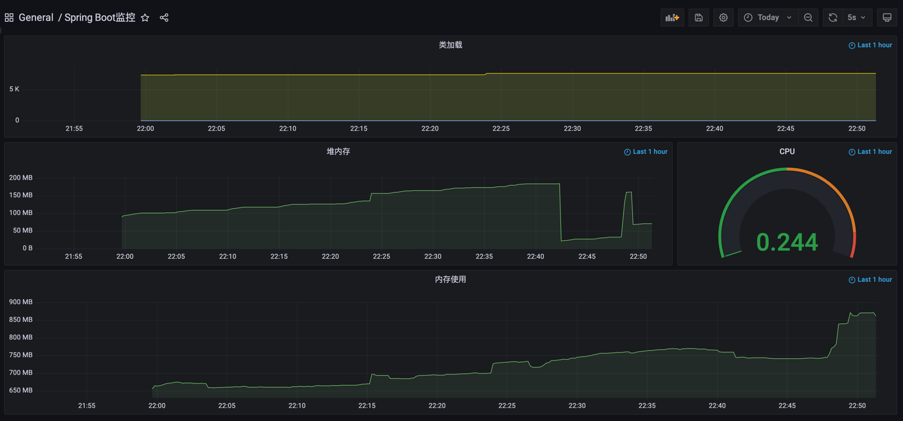

# Spring-boot-monitoring

Spring boot项目监控，作为一个示例项目，研究其可行性。使用[Spring initializr](https://start.spring.io)生成一个可运行的简单Spring boot项目，开启Actuator和Jolokia支持，使用Telegraf采集项目运行信息，InfluxDB时序数据库存储数据，Grafana展示数据。



## 开始

下面说明怎样运行此项目并看到效果。首先克隆此项目：

```
git clone https://github.com/dachengxi/spring-boot-monitoring.git
```


### 准备

需要安装的列表

- influxdb
- telegraf
- grafana

### 安装

```
以上软件的安装步骤自行参考官方文档，这里不做重复。
```

### 配置

telegraf：

```
vi /etc/telegraf/telegraf.conf
```

打开或者添加以下配置

```
[[inputs.jolokia]]
	context = "/actuator/jolokia/read/"

[[inputs.jolokia.servers]]
     name = "spring-boot-monitoring"
     host = "127.0.0.1"
     port = "8080"

[[inputs.jolokia.metrics]]
     name = "heap_memory_usage"
     mbean  = "java.lang:type=Memory"
     attribute = "HeapMemoryUsage"

[[inputs.jolokia.metrics]]
     name = "thread_count"
     mbean  = "java.lang:type=Threading"
     attribute = "TotalStartedThreadCount,ThreadCount,DaemonThreadCount,PeakThreadCount"

[[inputs.jolokia.metrics]]
     name = "class_count"
     mbean  = "java.lang:type=ClassLoading"
     attribute = "LoadedClassCount,UnloadedClassCount,TotalLoadedClassCount"

[[inputs.jolokia.metrics]]
    name = "metrics"
    mbean  = "org.springframework.boot:name=metricsEndpoint,type=Endpoint"
    attribute = "Data"

[[inputs.jolokia.metrics]]
    name = "tomcat_max_threads"
    mbean  = "Tomcat:name=\"http-nio-8080\",type=ThreadPool"
    attribute = "maxThreads"

[[inputs.jolokia.metrics]]
    name = "tomcat_current_threads_busy"
    mbean  = "Tomcat:name=\"http-nio-8080\",type=ThreadPool"
    attribute = "currentThreadsBusy"

```

grafana：

运行grafana，访问http://localhost:3000，选择导入Dashboard，导入的文件是项目中哦个的grafana/Spring Boot监控.json文件

### 运行

将Spring Boot项目导入到IDEA中，运行项目！

## 构建

* [Maven](https://maven.apache.org/) - 依赖管理

## 贡献

暂无

## 作者

* **ChengXi** - ** - [dachengxi](https://github.com/dachengxi)

## License

This project is licensed under the MIT License！
